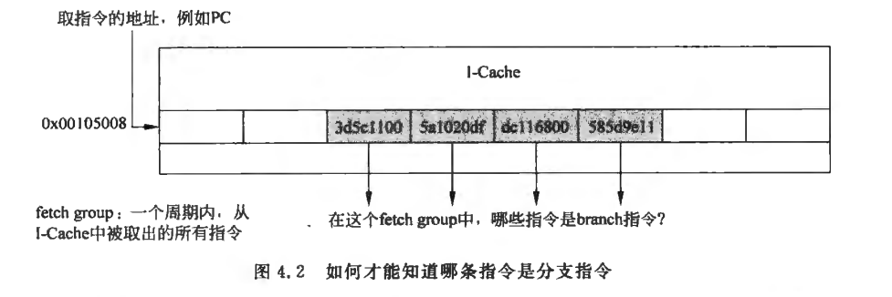
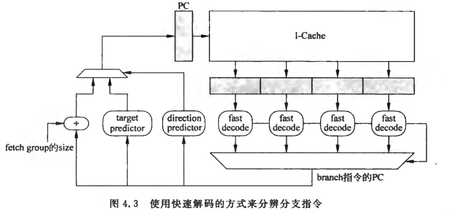
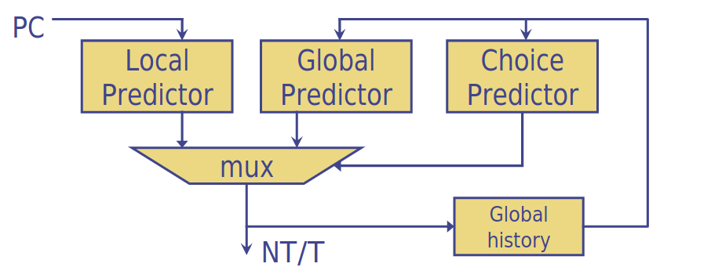
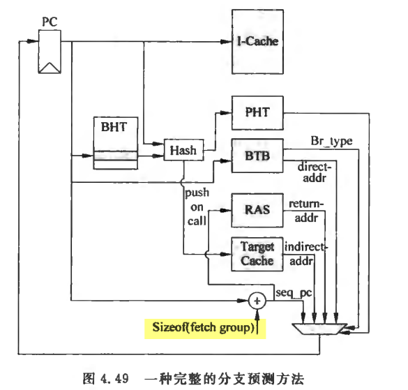

# 分支预测

## 基础知识

如果能在取指令阶段就可以预知本周期所取出的指令是否存在分支指令，并且可以知道他的方向以及目标地址的话，那么就可以在下个周期从分支指令的目标地址开始取指令，这样就不会对流水线产生影响，也避免作了无用功，提高了处理器的执行效率。这种不用等到分支指令的结果真的被计算出来，而是提前就预测结果的过程就是分支预测。

分支预测之所以能够实现，是由分支指令的特性决定的，因为分支预测本质上是对分支指令的结果进行预测，而一般的RISC指令集中，分支指令包含两个要素：
1. 方向

	* 发生跳转 Taken
	* 不发生跳转 not taken
2. 目标地址
	
	一般来说对于RISC指令集，目标地址在指令中可以有两种存在形式：
	1. PC relative，也称为直接跳转(direct)，在指令中直接以立即数的形式给出一个相对于PC的偏移值offset

		这种指令所携带的立即数一般是不会变化的，因此这种类型的分支指令时容易进行分支预测的，很多处理器的技术手册都会建议尽量使用这种类型的分支指令，就是为了提高分支预测的正确率。
	2. Absolute，也称为间接跳转(indirect)，分支指令的目标地址来自于一个通用寄存器的值。
		
		由于寄存器的值是会经常变化的，因此这种类型的分支指令很难对目标地址进行预测，但是庆幸的是，程序当中大部分间接跳转的分支指令，都是用来调用子程序的call/return类型指令，而这种类型的指令由于有着很强的规律性，是容易被预测的。

要进行分支预测，首先需要知道从I-Cache取出来的指令中，哪条指令是分支指令，这对于每周期取出多条指令的超标量处理器来说，更为不容易，需要从指令组中找出分支指令。



最容易想到的方法就是将指令组中的指令从I-Cache取出来之后，进行快速的解码，之所以称为快速，是因为只需要辨别指令是否是分支指令，然后将找到的分支指令对应的PC值送到分支预测器就可以对分支指令进行预测了。



当处理器周期时间比较小时，I-Cache的访问可能需要多个周期才可以完成，采用图4.3的方式进行分支预测，从开始取指令到分支预测得到结果，中间需要间隔好几个周期，在这些周期内无法得到准确的结果，只能顺序地取指令，这样降低了分支预测的准确度，造成了处理器性能的下降。同时指令快速解码和分支预测的过程都放在一个周期，严重影响了处理器的周期时间。

为了解决这个问题，可以在指令从L2 Cache写入到I-Cache之前进行快速解码，这也成为预解码(pre-decode)，然后将指令是否是分支指令的信息和指令一起写到I-Cache中，这样虽然会使I-Cache占用更多的面积，但是可以省掉图4.3的快速解码电路，在一定程度上缓解对处理器周期的影响，但是取指令直到分支预测得到结果这两个阶段的间隔时间仍然是过长的，无法得到解决。

在流水线中，分支预测越靠前越好，如果指令从I-Cache取出来之后才进行分支预测，那么由于I-Cache中取出指令的过程可能需要多于一个周期才能够完成，当得到分支预测结果时，已经有很多后续的指令进入流水线，这样当预测失败时，这些指令都需要从流水线中抹掉(flush)，这样就降低了处理器的执行效率。**因此分支预测的最好时机就是在当前周期得到取指令地址时，在取指令的同时进行分支预测，这样在下周期就可以根据预测的结果继续取指令。**

在PC值刚刚产生的那个周期，根据这个PC值来预测本周期的指令组(fetch group)中是否存在分支指令以及分支指令的方向和目标地址。

### 分支指令的方向预测

现代处理器中应用最广泛的分支预测方法都是基于两位饱和计数器，并以之为基础，引申出的各种分支预测的方法。

#### 两位饱和计数器(2-bit saturating counter)

基于两位饱和计数器的分支预测方法并不会马上使用分支指令上一次的结果，而是根据一条分支指令前两次的执行结果来预测本次的方向。这种方法可以用一个有着4个状态的状态机来表示，分别是
1. Strongly Taken
2. Weakly Taken
3. Weakly Not Taken
4. Strongly Not Taken


一般来讲，使用Strongly Not Taken或者Weakly Not Taken作为初始态。

可以使用格雷码对状态机进行编码，保证在状态转换时每次只有一位发生变化，这样可以减少出错的概率，并降低功耗。

在前面说过，分支预测都是以PC值为基础进行的，正常来说，每一个PC值都应该对应一个两位的饱和计数器，但考虑到存储大小，实际芯片中一般选取PC的k位来作为索引。索引的表格称为PHT(Pattern History Table)，其中存放着PC值对应的两位饱和计数器的值

当使用PC的13位来寻址PHT，此时PHT的大小为2KB，分支预测准确度可以达到93%

在基于两位饱和计数器的分支预测方法中，别名会降低分支预测的准确度，可以采用一些更高级的方法来避免别名情况的发生，比较典型的方法就是使用哈希(Hash)对PC值进行处理之后再去寻址PHT。

##### 计数器更新时间点
1. 流水线的取指令阶段，进行分支预测时，根据预测的结果来更新PHT
2. 流水线的执行阶段，当分支指令的方向被实际计算出来时，更新PHT
3. 流水线的提交阶段，当分支指令要离开流水线时，更新PHT

第一种方法是不适用的，因为此时分支预测的结果可能是错误的。

由于超标量处理器有着很深的流水线和每周期执行好几条指令的这两个特点，导致一条分支指令可能在PHT更新之前就被取过很多次了，但是考虑到这种饱和计数器的特点，只要计数器处于饱和状态，所以并不会对分支预测的精度产生太大的负面影响，所以第三种方法在分支指令被确认已经正确执行的时候，更新PHT才是万无一失的。第二种方法可能存在分支预测失败的路径上，因此也是不靠谱的。

由于基于两位饱和计数器的分支预测方法正确率存在极限值，很难达到98%以上的正确率，**因此现代的处理器都不会直接使用这种方法了。**

#### 基于局部历史的分支预测

使用一个寄存器来记录一条分支指令在过去的历史状态，当这个历史状态很有规律时，就可以为分支预测提供一个可以利用的工具，这样的寄存器称为分支历史寄存器(Branch History Register,BHR)，这种预测方法称为基于局部历史的预测方法。


这种方法也称为自适应的两级分支预测(Adaptive Two-level Predictor)，一个位宽为n位的BHR寄存器可以记录一条分支指令过去n次的结果，对BHR使用一个两位的饱和计数器来捕捉他的规律，因此需要使用BHR去寻址PHT，此时的PHT仍旧是一个表格，他的大小为2[^n] x 2bit，PHT当中存有**BHR的每种取值对应的两位饱和计数器的值**。

理论上来讲，每条分支指令都有一个BHR寄存器和一个PHT。这样需要很大的存储空间，将所有分支指令的BHR组合在一起称为分支历史寄存器表(Branch History Register Table,BHRT或BHT)，在实际中，BHT不可能照顾到每个PC，一般都是使用PC的一部分来寻址BHT，相当于一些PC会共用BHR，同时PHT由于要占用大量的存储空间，更需要被复用。

#### 基于全局历史的分支预测

如果对一条分支指令进行分支预测时，考虑到它前面的分支指令的执行结果，则称这种预测方法为基于全局历史(Global History)的分支预测。

只使用一个BHR来记录所有的分支指令的执行结果，这个寄存器也被称为全局历史寄存器(Global History Register,GHR)

最理想的情况下是对每条分支指令都使用一个PHT，这样每条分支指令都会使用当前的GHR来寻址自身对应的PHT，但是很显然，这种方法在实际当中是无法使用的，为每个PC值都使用一个PHT会占据非常大的空间，因此一般都会使用哈希法将PC进行处理。

#### 竞争的分支预测

可以设计一种自适应的分支预测方法，根据不同的分支指令的执行情况自动地选择采用局部历史分支预测和全局历史分支预测。Alpha 21264处理器就使用了这种方法，称为竞争的分支预测(Tournament Predictor)，就像是两种分支预测方法在竞争一样。



当其中一种分支预测方法两次预测失败，而同时另一种方法两次预测成功时，会使状态机转到使用另一个分支预测方法的状态。

#### 分支预测的更新

理想的分支预测方法遵循这样的顺序：根据PC值进行分支预测，使用预测的结果来继续执行，等到真正得到一条分支指令的结果之后，更新分支预测器(branch predictor)中的相关内容。但是在实际的超标量处理器当中，对分支预测器的更新需要考虑到流水线的影响，对于基于局部历史和全局历史的两种类型的分支预测，**什么时候更新分支预测器，对分支预测的准确度是有影响的**，对分支预测来说，需要更新的内容包括两个方面：
1. 历史寄存器

	BHR or GHR
	
	在基于全局历史进行分支预测的方法中，考虑到现代的超标量处理器每周期要同时执行多条指令，并且有着很深的流水线，因此在取指时更新GHR，即使预测失败，后续的指令都使用了错误的GHR也没有关系，因为这些分支指令都出现在分支预测失败的路径上，都会被从流水线中抹掉。
	但这种更新GHR的方式在分支预测失败时，需要一种机制对GHR进行修复，使GHR能够恢复到正确的值，下面介绍两种修复方法。
	1. 提交阶段修复法，在流水线的提交阶段也放置一个GHR，每当一条分支指令退休时，将结果更新到这个GHR，这个GHR肯定是正确的，当预测失败时，用提交阶段的GHR帮助前端的GHR更新。

		该方法只能等到分支指令退休时才能对GHR进行舅父，中间间隔时间太长。
	2.CheckPoint修复法，在取指令阶段对前端的GHR更新的同时，将旧的GHR保存下来，这个保存的内容就成为CheckPoint GHR，一旦这条分支指令的结果在流水线中被计算出来，就可以对这条分支指令的分支预测是否正确进行检查了。
		
		如果乱序执行分支指令，执行阶段的得到分支指令的结果仍有可能是错误的，所以仍旧需要在流水线的提交阶段对分支指令的预测是否正确进行检查。
	
		因此本质上看，这种CheckPoint方法相当于对方法一进行了补充，除了在流水线的提交阶段可以对GHR进行恢复，还可以在流水线的执行阶段对他进行恢复，这样加快分支指令预测失败的恢复时间。

	在基于局部历史的分支预测方法中，BHR的更新可以是推测的，也可以不推测的。可以在分支指令退休时更新BHR，这样可以简化设计，也不会对处理器的性能产生太大的不免影响。
2. 两位饱和计数器

	由于饱和计数器的特性，因此一般在分支指令退休的时候对PHT中的饱和计数器进行更新。


### 分支指令的地址预测

1. 直接跳转的分支预测

	对与直接跳转(PC-relative)的分支指令来说，他的目标地址有两种情况。
	1. 不跳转

		PC + sizeof(fetch group)
	2. 跳转

		PC + sign_extend(offset)

	由于分支预测是基于PC值进行的，不可能对每一个PC值都记录下他的目标地址，所以一般都使用Cache的形式，使多个PC值共用一个空间来存储目标地址，这个Cache称为BTB(Branch Target Buffer)

	一般情况下，为了最大限度地利用BTB中有限的存储资源，只将发生跳转的分支指令对应的目标地址放到BTB中，那些预测不发生跳转的分支指令，他们的目标地址其实就是顺序取指令的地址，因此不需要进行预测。

	当预测跳转发生时，BTB缺失时，可以停止执行，阻塞流水线或继续顺序执行。顺序执行存在正确的可能性，因为有可能方向预测失败，但浪费功耗。
2. 间接跳转的分支预测

	对于间接跳转类型的分支指令来说，他的目标地址来自于通用寄存器，是经常变化的，所以无法通过BTB对它的目标地址进行准确的预测。

	1. Call/Return 指令的分支预测
		
		很多RISC处理器来说，可能在指令集中没有直接的CALL/RETURN指令，而是使用其他的指令来模拟这个功能。	对于Call指令来说，每次调用的子程序都是固定的，因此可以使用BTB对Call指令的目标地址进行预测。

		由于Return指令的目标地址总是等于最近一次执行的Call指令的下一条指令的地址，因此可以设计一个存储器，保存最近执行的Call指令的下一条指令的地址，这个存储器是后进先出的LIFO。这个存储器的工作原理和堆栈是一样的，称之为返回地址堆栈(Return Address Stack,RAS)

		要使RAS能够正确工作，需要如下两个前提条件：
		1. 遇到Call指令，将Call指令的下一条指令的地址放到RAS中，这需要**识别出哪条指令是Call指令**。如果译码阶段识别会降低流水线效率，因此借助BTB来实现，在BTB中添加一项，用来标记分支指令的类型。
		2. 对Return指令进行目标地址预测时，需要能够选择RAS的输出作为目标地址的值，而不是选择BTB的输出值，因此**仍需要在分支预测阶段就可以知道指令的类型**，这依然可以通过如上所述的方法。
	2. 其他预测方法
		
		对于间接跳转(absolute)类型的分支指令，如果它既不是Call指令，又不是Return指令时，如何预测他的目标地址？	
	
		对于间接跳转类型的分支指令来说，他的目标地址也可能是和过去的执行情况有关系，因此可以利用局部历史的分支预测方法中使用的BHR对目标地址进行预测。只是将PHT换成Target Cache。对于一条间接类型的分支指令，他的目标地址可能出现的值是有限的，所以使用Target Cache有可能覆盖到所有的情况。

到目前为止，对于分支指令的目标地址的预测，有下面的三种方法：
1. 使用BTB对直接跳转类型的分支指令和Call指令进行预测
2. 使用RAS对Return指令进行预测
3. 使用Target Cache对其他类型的分支指令进行预测。

**尤其是对于BTB和RAS，几乎是现代超标量处理器必须要使用的。**



### 分支预测失败时的恢复

当一条分支指令在执行阶段发现预测错误时，需要将在它后面进入流水线的所有指令都抹掉，根据超标量处理器流水线的特点，这个过程实际上包括两部分
1. 在流水线的发射(issue)阶段之前的所有指令都需要全部被抹掉，因为在发射阶段之前指令依然维持着程序中原始的顺序(in-order)，而在流水线中，执行阶段位于发射阶段之后，因此当前在执行阶段发现了一条预测错误的分支指令时，流水线的发射阶段之前的所有指令必然全部处于分支预测失败的路径上。他们都可以从流水线中被无差别的抹掉，这个过程在一个周期内就可以完成。
2. 在流水线的发射阶段以及之后的流水段中，值令将按照乱序的方式来执行，一部分指令可能处于分支预测失败的路径上，这样就需要使用编号列表(tag list)中的编号值将他们找出来抹掉，这个过程会比较复杂，在一个周期内很可能无法完成。

```{note}
其实并不一定需要在一个周期之内将重命名缓存ROB和发射队列中的相关指令都抹掉，因为在流水线的执行阶段发现一条分支指令预测错误时，需要从正确的地址开始取指令，这些新取出来的指令需要经过流水线的好几个阶段才可以到达发射阶段。
```

将流水线中相关指令抹掉后，就需要使用Checkpoint对处理器的状态进行恢复，主要是对寄存器重命名阶段的映射表(mapping table)进行恢复。

在超标量处理器中可以进行一个这种的规定，在流水线的解码阶段每周期最多只能处理一条分支指令，(否则就需要多端口的编号列表)如果在解码阶段，发现从指令缓存中读出的N条指令中存在多于一条的分支指令，那么第二条分支指令及其后面的所有指令就不能在本周期进入译码阶段，他们会被延迟到下一个周期，对于大部分程序来说，分支指令都不密集，因此这种方法不会对性能造成太大的负面影响。

对于分支预测结果的检查，还需要考虑一个问题：当分支指令到了执行阶段得到了实际的结果，并对分支预测是否正确进行检查时，如何才能够知道这条分支值令在之前的预测值？

可以将每条分支指令的预测值写到一个缓存中

例子：PTAB(Prediction Target Address Buffer)，他主要由三部分组成
1. Valid
2. Predict Address
3. Next PC：用于预测错误恢复

一条分支指令如果被预测发生跳转，那么会将它的信息写到 PTAB 中，同时这条分支指令在 PTAB 中的地址也随着分支指今在流水线中流动，这样，当这条分支指今到达流水线的执行阶段时，就可以使用这个地址，直接从 PTAB中找到对应的预测信息了。



### 超标量处理器的分支预测

到目前为止，分支预测都是对一条指令进行分支预测。但是对于超标量处理器，每次从I-Cache中取出多条指令，这些取出的指令组成了一个指令组，处理器会自动根据指令组中指令的个数调整取指令的地址，因此超标量处理器中**取指令的地址不是连续的**。

当然对于分支预测器来说，只需要记录下每四组对齐的指令中，第一个预测跳转的分支指令的信息就可以了，因为在大多数情况下，**每四字对齐的四条指令中最多也就存在一条分支指令**。同时在BTB中需要记录分支指令在四条指令中的位置，避免有些时候错误使用他的结果。

如果对于一个4-way的超标量处理器来说，每周期取出的指令可以不限于四字对齐的边界之内，那么要达到最理想的效果，就需要对一个周期内取出的所有指令都进行分支预测，将第一个预测跳转(taken)的分支指令的目标地址作为下个周期取指令的地址。

这需要多个读端口的BTB和BHT。


## 动手实践
