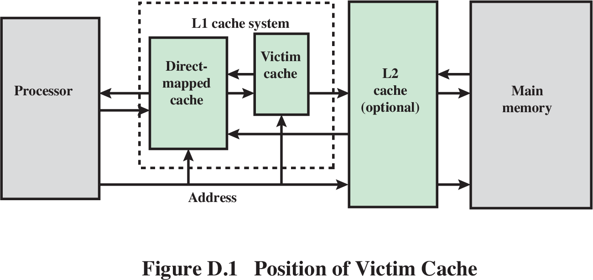

# 高速缓存设计

自从我们给CPU添加了AXI总线接口并去除了指令RAM和数据RAM之后，他的运行效率就大打折扣了，运行同样的程序需要花费更多的时间周期。以我举例，此时的IPC已经降到了0.01-0.02之间。

```{admonition} 那么去除指令RAM和数据RAM是不是一种设计倒退呢？

其实不然，指令RAM和数据RAM的使用要求软件人员明确掌握物理内存的容量、起始地址，增加了软件的开发难度。目前这种硬件架构仅在那些对于成本、功耗或执行延迟的确定性极为敏感的低端嵌入式领域广泛使用。那些应用领域还有一个特点是软件规模不大、程序行为相对确定，否则没有虚拟化存储管理对于应用开发来说就是灾难。纵然指令RAM和数据RAM有这样的不足，但是性能问题也是要解决的。

```


我们的解决思路就是增加高速缓存(Cache)


## 基础知识

### Cache的一般设计

纵观Intel每次处理器升级，都会改进分支预测和Cache这两个部件，使分支预测的精度更高，Cache的命中率更高，速度也更快。

Cache之所以存在，是因为在计算机中存在如下两个现象:
1. 时间局部性(temporal locality)
2. 空间局部性(spatial locality)

Cache主要由两部分组成，Tag部分和Data部分。一个Tag和它对应的所有数据组成的一行称为一个Cache line，而Cache line中的数据部分称为数据块Cache block，如果一个数据可以存在Cache中的多个地方，这些同一个地址找到的多个Cache line称为Cache set。

Cache有三种主要的实现方式，直接映射、组相连和全相连。现代处理器的Cache一般属于三种方式中的某一个，例如TLB和Vcitim Cache多采用全相连结构，而普通的I-Cache和D-Cache则采用组相连结构。

### Cache的写入

在一般的RISC处理其中，I-Cache都是不会被直接写入内容的，即使有自修改(self-modifying)的情况发生，也并不是直接写I-Cache，而是要借助于D-Cache来实现，将要改写的指令作为数据写到D-Cache中，然后将D-Cache中的内容写到下级存储器中(例如L2 Cache，这个存储器一定是被指令和数据共享的，这个过程称为clean)，并将I-Cache中的所有内容置为无效，这样处理器再次执行时，就会使用到那些被修改的指令了。

### Cache的替换

1. LRU
维持Cache line的年龄值，每次一个Cache line被访问时，对应的年龄部分就会增加，或者减少其他的Cache line的年龄值。这样当进行替换时，年龄值最小的那个Cache line就是被使用次数最少的了。
2. PLRU
对所有的way进行分组，每组使用一个1位的年龄部分。
3. 随机替换
相比于LRU替换算法，这种方法发生缺失的频率会更高一些，但是随着Cache容量的增大，这个差距是越来越小的。当然在实际的设计中很难实现严格的随机，一般采用一种称为时钟算法的方法来实现近似的随机。

### 提高cache的性能

在真实世界的处理器中，会采用更复杂的方法来提高Cache的性能，这些方法包括写缓存(write buffer)、流水线(pipelined Cache)、多级结构(multilevel Cache)、Victim Cache和预取(prefectching)等方法，不管是顺序执行还是乱序执行的处理器，都可以从这些方法中受益。除此之外，对于乱序执行的超标量处理器来说，根据他的特点，还有一些其他的方法来提高Cache的性能，例如非阻塞(non-blocking) Cache、关键字优先(critical word first)和提前开始(early restart)等方法。

1. write buffer

	脏状态的Cache line会首先写到写缓存中，等到下级存储器有空闲时，才会将写缓存的数据写到下级存储器。
	使用写缓存之后，可以将D-Cache中的数据写到下级存储器的时间进行隐藏。
	当然加入写缓存之后，会增加系统设计的复杂度，举例来说，当读取D-Cache发生缺失时，不仅需要从下级存储器中查找这个数据，还需要在写缓存中进行查找，如果在其中发现了缺失的数据，那么就需要使用它。
2. pipelined Cache
	
	在主频比较高的处理器中，写D-Cache的操作很那在一个周期内完成，读取Tag SRAM和写Data SRAM的操作只能串行地完成，需要划分成流水线。
3. multilevel Cache
	
	一般在处理器中，L2 Cache会使用写回(Write Back)的方式，但是对于L1 Cache来说，写通(Write Through)的实现方式也是可以接受的，这样可以简化流水线的设计，尤其是便于在多核的环境下，管理存储器之间的一致性(coherence)，因此一些多核处理器对L1 Cache都采用了写通的方式。
	
	对于多级结构的Cache，还需要了解两个概念Inclusive和Exclusive，以L1 Cache和L2 Cache为例，这两个概念如下:
	* Inclusive: 如果L2 Cache包括了L1 Cache中的所有内容，则称L2 Cache是Inclusive

		浪费硬件资源，但是简化了一致性管理。
	* Exclusive: 如果L2 Cache和L1 Cache中内容互不相同，则称L2 Cache是Exclusive
4. Victim Cache

	有时候，Cache中被“踢出”的数据可能马上又要使用，这是很有可能的。如果为此而增加Cache中way的个数，又会浪费掉大量的空间，因为其他的Cache set未必有这样的特征，Victim Cache可以保存最近被踢出Cache的数据，因此所有的Cache set都可以利用他来提高way的个数，通常Victim Cache采用全相连的方式，容量比较小(一般可以存储4～16个数据)。
	
	

	一般情况下，Cache和Victim Cache存在互斥的关系，也就是他们不会包括同样的数据，处理器内和可以同时读取他们。
	
	还有一种和Victim Cache类似的设计思路，称为Filter Cache，只不过他使用在Cache之前，而Victim Cache使用在Cache之后，当数据第一次被使用时，他并不会马上放到Cache中，而是首先会被放到Filter Cache中，等到这个数据再次被使用时，他才会被搬移到Cache中，这样可以防止那些偶然被使用的数据占据Cache。

5. Prefetch

	解决Compulsory缺失，本质上也是一种预测技术。

```{admonition} 3C定理
影响Cache缺失的情况可以概括如下:
1. Compulsory
	
	强制实效，对没有在Cache中出现过的块进行第一次访问时产生的失效，也称为冷启动失效。可采用预取的方法来尽量降低这种缺失发生的频率。
2. Capacity

	Cache中无法包含程序执行期间所需要的所有块而引起的失效。当某些块被替换出去，随后再被调入时，将发生容量失效。
3. Conflict

	在组相连或直接映射Cache中，很多块为了竞争同一个组导致的失效。冲突失效是直接映射或组相连Cache中的失效，而在相同大小的全相连Cache中不存在。
```

* 硬件预取

	访问数据块时，将后面的数据块也取出来放到Cache中。当然由于程序中存在分支指令，所以这种猜测有时候也会出错，导致不会使用的指令进入I-Cache，这一方面降低了I-Cache实际可用的容量，一方面又占用了本来可能有用的指令，这称为“Cache 污染”。为了避免这种情况，可以将预取的指令单独放到一个缓存中。
	
	不同于指令的预取，数据的预取规律更难以进行捕捉。一般情况下，当访问D-Cache发生缺失时，除了将所需要的数据块从下级存储器中取出来之外，还会将下一个数据块也读取出来，这种方法被广泛地应用于现实的处理其中，但是这种方法并不总是很有效，因为程序以后要访问的数据有可能并不在下一个数据块中，这时候的预取就会浪费带宽和功耗。
* 软件预取

	使用硬件进行数据的预取时，很难得到满意的结果，其实在程序的编译阶段，编译器就可以对程序进行分析，进而知道哪些数据时需要进行预取的，**如果在指令集中设有预取指令(prefetching instruction)**，那么编译器就可以直接控制程序进行预取。

```{caution}
还需要注意的是，使用软件prefetch的方法，当执行prefetch指令的时候，处理器需要能够继续执行，也就是继续能够从DCache中读取数据，而不能够让预取指令阻碍了后面执行的执行，这就要求DCache是非阻塞(Non-blocking)结构的。
```
	

6. Multi-Port Cache

在超标量处理器中，为了提高性能，处理器需要能够在每周其同时执行多条load/store指令，这需要一个多端口的D-Cache，以便能够支持多条load/store指令的同时访问，**因此多端口的D-Cache是在超标量处理器中必须要面对的问题。**

其实在超标量处理器中，有很多部件都是多端口结构的，例如寄存器堆、发射队列和重排序缓存(ROB)等，但是由于这些部件本身的容量并不是很大，所以即使采用多端口结构，也不会对芯片的面积和速度产生太大的负面影响，但是D-Cache不同，他的容量本身就很大，如果再采用多端口的设计，会对芯片的面积和速度带来很大的负面应吸纳更，因此需要一些方法来解决这个问题，有很多方法都可以实现多端口的D-Cache，本节重点介绍三种方法。

* True Multi-port

* Multiple Cache Copies

* Multi-banking
	将Cache划分为很多个小的bank，每个bank都只有一个端口，此时Data SRAM不需要实现多端口结构了，这样提高了速度，并在一定程度上减少了面积。但是由于需要判断Cache的每个端口是不是命中，所以对于Tag SRAM来说，仍旧需要提供多个端口同时读取的功能，也就是需要采用多端口SRAM来实现，或者采用将单端口SRAM进行复制的方法。

## 动手实践

本章节主要参考《CPU设计实战》第10章“高速缓存设计”

在本章中，我们会把Cache的设计复杂度控制在入门级水平，兼顾性能

### Cache规模的设计

解决Axi总线速度缓慢的思路——高速缓存(Cache)

#### Cache的设计规格

首先我们来明确以下与Cache相关的主要设计规格，避免因为后续的讨论过于宏观而无法具体到细节。这些设计规格包括以下方面：
1. CPU内集成一个指令Cache和一个数据Cache。避免取指和取数产生结构冒险。
2. 指令Cache和数据Cache的容量均为8KB，均为两路组相连，Cache line大小均为16B
3. 指令Cache和数据Cache采用Tag和Data同步访问的形式。
4. 指令Cache和数据Cache均采用“虚Index实Tag”(简称VIPT)的访问形式
5. 指令Cache和数据Cache均采用伪随机替换算法
6. 数据Cache采用写回写分配的策略，指令Cache不考虑写策略
7. 指令Cache和数据Cache均采用阻塞式(Blocking)设计，即一旦发生Cache Miss，则阻塞后续访问直至数据填回Cache中。
8. Cache不采用“关键字优先”技术
   
我们解释以下制定上述设计规格的初衷
* 设计一个指令Cache和一个数据Cache是为了保证流水线能够满负荷运行
* 指令Cache和数据Cache各方面规格一致，确保即使不把Cache模块写成可参数化的，也可以通过所定义的Cache模块实例化两份分别用于实现Cache和数据Cache，减轻代码开发和调试的工作量。
* 将每一路Cache的容量定义为4KB是为了在采用VIPT访问方式的同时规避Cache别名问题。
* Cache采用VIPT可以将TLB的查找和Cache的访问并行进行，从而提高CPU的频率
* Cache采用阻塞式设计，主要是因为目前我们实现的是一个静态顺序执行的流水线，即使Cache设计成非阻塞式也不会带来整体的性能提升。
* Cache不采用“关键字优先”技术，可以降低与Axi总线交互的复杂度。
  
根据上述设计规格，我们可以计算地址相关的Tag、Index和Offset位数。
* Offset: Cache行内偏移，宽度为log2(sizeof(Cache line)) = 4
* Index:  Cache组索引,宽度为log2(组数) = log2(256) = 8
* Tag:    Cache行的标签，宽度为物理地址宽度-log2(路大小) = 64 - 8 - 4 = 52
```{note}
由于我们还没实现TLB，因此目前CPU发出的地址可以认为是物理地址
```

#### Cache表的组织管理

落实到Verilog中即我们有
* 两张256项 x 52 bits的Tag表
* 两张256项 x 1 bits的V表
* 两张256项 x 1 bits的D表
* 两张256项 x 128 bits的Data表

```{note}
既然是存储信息的表，电路上肯定要用存储器件来实现，通常是用Regfile或RAM来实现，我们常用的指导思想是，容量大的表（如Bank表）用RAM实现，容量小的表（如D表）用Regfile实现。
```

我们依据在读、写操作访问Cache执行过程中所属的不同阶段，将对Cache模块进行的访问归纳为四种：Look Up、Hit Write、Replace和Refill，下面给出四种访问的定义。
* Look Up: 根据地址中的index信息读取对应的两个Cache line，为下一阶段判断是否在Cache中作准备
* Hit Write: 命中的读操作将数据返回，写操作进入Write Buffer，随后将数据写入命中的Cache line的对应位置
* Replace: 为了给Refill的数据空出位置而发起的一个读取Cache行的操作
* Refill: 将内存返回的数据(以及store miss待写入的数据)填入Replace空出的位置上

```{caution}
Tag表、V表和D表同一时刻至多接收一个读请求或写请求。
Data表情况略微有些复杂，因为来自一个读操作的LookUp和来自一个写操作的Hit Write可能同时发生。这样的例子为
```store   xxxx   load    xxxx```
当store指令写数据命中时，会将数据传给Write Buffer然后由这个Write Buffer来写入数据，同时执行下一条指令，如果下一条指令是store或load指令时，就会出现上面的情况。

至于为什么在写命中Cache和写入Cache之间引入一个Write Buffer，是出于时序方面的考虑，避免引入RAM输出端到RAM输入端的路径：Cache命中信息来自Cache RAM读出的Tag的比较结果，命中的写操作需要根据Tag的比较结果来生成Cache里的哪个路径，如果命中时直接写，就引入了Cache RAM的Tag读出到Cache RAM的Data写使能这一路径。

因此我们需要在LookUp和Data Write访问同一数据阻塞LookUp操作。
```

#### Cache模块功能边界划分

CPU流水线向Cache模块发送请求，Cache模块给CPU流水线返回数据或是写成功的响应。

axi_rw模块为内部访存总线到AXI总线的接口转换模块。这个接口转换模块对CPU内部有多个端口，对CPU外部只有一个AXI总线接口，我们把多个请求之间的仲裁、AXI协议的处理都放到这个模块中，这样Cache模块与这个AXI总线模块接口之间的功能划分依然是很简洁的，Cache模块向AXI总线接口发送请求，AXI总线接口模块返回数据或响应。

Cache模块向AXI总线发送的请求中的地址、操作类型、长度等信息一拍之内交互完毕即可。对于读操作，AXI总线接口模块每周期至多给Cache模块返回32位数据，Cache模块将返回的数据填入Cache的Bank RAM中或者直接将其返回给CPU流水线；对于写操作，Cache模块在一个周期内直接将一个Cache line的数据传给AXI总线接口模块，AXI总线接口模块内部设一个16字节的写缓存保存这些数据，然后以Burst方式发出去。

由于此时mem阶段可能会同时需要Axi总线读和写，因此将axi_rw模块对内接口调整为两组读接口和一组写接口。


### 将Cache集成到CPU中

需要修改的模块：
1. axi_rw模块。转换为两读一写
修改接口即可，去除```mem_req_i```信号，转而使用```mem_rvalid_i```和```mem_wvalid_i```信号来区分mem阶段的读请求和写请求，需要修改input信号和信号影响的组合逻辑以及状态机中状态的转换条件。
2. 增加pre-if模块，实现pre-if发送地址，if得到指令的时序
将if_stage模块中的new_pc作为inst_addr发出，
3. 在exe阶段发送访存地址，mem阶段获得结果，注意异常时需要无效信号
exe阶段需要检查mem阶段和wb阶段的exception_flag信号，如果异常则置```mem_rvalid```和```mem_wvalid```信号为无效
4. 增加cache模块，实现和cpu以及axi_rw的对接

此时axi_rw中读的数据宽度为64，写的数据宽度为128。

多次读取可以方便以后搞关键字优先

Cache和CPU流水线的交互接口
|  名称   | 位宽  |  方向  |  含义  |
|  ----  | ----  | ----  | ----  |
| valid |   1   |  IN    | 表明请求有效 |
| op    |   1   |  IN    | 表明请求类型，1为write，0为read |
| index |   8   |  IN    | 地址的index域(addr[11 : 4])|
| tag   |   52   |  IN    | 地址的tag域，从tlb（如果有的话）查询到的地址形成的tag，由于来自组合逻辑运算，故与index为同拍信号|
| offset|   4   |  IN    | 地址的offset域(addr[3 : 0])|
| wstrb |   8   |  IN    | 写字节使能信号|
| wdata |   64   |  IN    | 写数据|
| addr_ok |   1   |  OUT  | 该次请求的地址传输OK，读：地址被接收；写：地址和数据被接收|
| data_ok |   1   |  OUT    | 该次请求的数据传输OK,读：数据返回；写：数据写入完成|
| rdata |   64   |  OUT    | 读cache的结果|

Cache和AXI总线的接口
|  名称   | 位宽  |  方向  |  含义  |
|  ----  | ----  | ----  | ----  |
| r_valid |   1   |  OUT    | 读请求有效信号|
| r_addr    |   64   |  OUT    | 请求地址，1为write，0为read |
| r_type |   3   |  OUT    | 读请求类型|
| r_ready   |   1   |  OUT    | 读请求能否被接收的握手信号|
| r_valid   |   1   |  IN    | 读数据有效信号|
| r_last   |   1   |  IN    | 读数据为最后一个返回数据信号|
| w_valid|   1   |  OUT    | 写请求有效信号|
| w_strb |   8   |  OUT    | 写字节使能信号|
| w_data |   64   |  OUT    | 写数据|
| w_addr |   1   |  OUT  | 写地址|
| w_type |   3   |  OUT    | 写请求类型|
| w_ready |   1   |  IN    | 写请求能否接收的握手信号，此处要求ready信号要先于valid信号置起，valid信号看到ready后才可能置起，ready信号当AXI总线接口内部的16字节缓存为空时置起|

```{note}
将地址分为index、tag和offset传送为了后面添加tlb作准备，此时直接传入addr，后续添加tlb后需要添加tlb转换后的地址
```

#### 集成ICache

#### 集成DCache


可优化地方：
1. 读数据和tag时同时读取dirty位，然后replace时如果dirty位为0，则不用replace。
