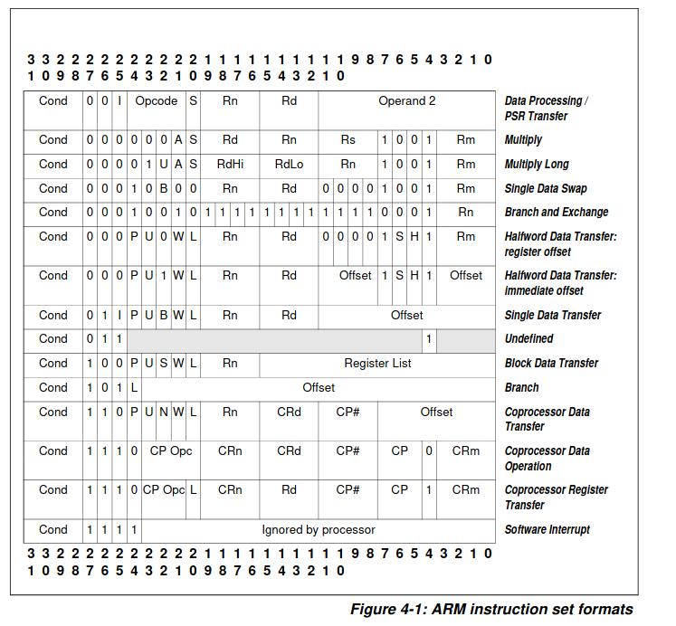

# 指令集体系

指令集体系(Instruction architecture set,ISA)是规定处理器的外在行为的一些内容的统称，它包括基本数据类型、指令、寄存器、寻址模式、存储体系、终端、异常以及外部I/O等内容，规定了处理器的行为。

ARM指令集从本质上来讲，和MIPS指令集是类似的，但是两者的设计理念还有有区别的，ARM指令集或多或少地借鉴了复杂指令集的一些特点，**在一条指令中尽量作了很多任务**，这是有别于MIPS指令的一个显著特点。

ARM指令集中，每条指令都可以条件执行。同时由于包含了条件码，寄存器寻址位数少，只有16个寄存器。

ARM中PC是通用寄存器，存在PUSH/POP指令，立即数循环右移，无效的立即数需要放在存储器中，然后PC相对寻址load出来，没有HI/LO指令，可以选择性更改CPSR寄存器的值，后面跟着条件执行指令

ARM中没有专门的移位指令，这是因为ARM中大部分运算指令都可以将源操作数在运算之前进行移位。

隔离指令可以保证他之前的指令都执行完毕，并且改变了处理器的状态之后，才允许后面的执行。在超标量处理器中，隔离指令到达流水线的最后阶段，并且退休的时候，会引发处理器将流水线中所有指令**都抹掉**，然后重新从隔离指令后面的地址开始取指令。如MIPS的SYNC
