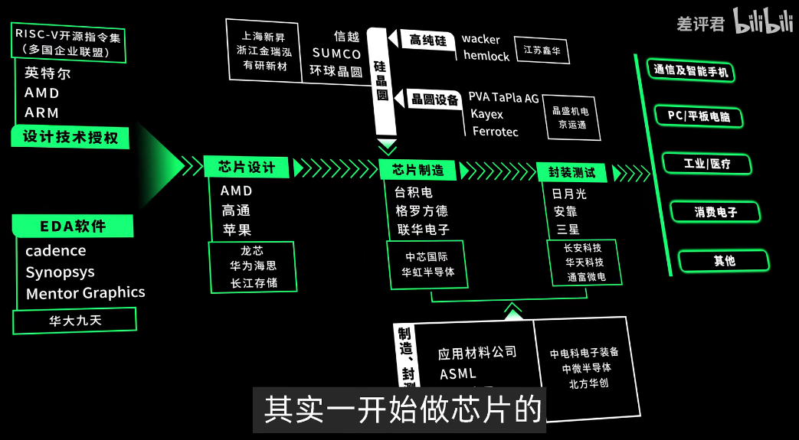

摘抄自《教你设计CPU-RISCV处理器》

通俗来讲处理器架构的位数是指通用寄存器的宽度，其决定了寻址范围的大小、数据运算能力的强弱。
```{caution}
处理器指令集架构的宽度和指令的编码长度无任何关系。并不是说64位架构的指令长度为64位，从理论上讲，指令本身的编码长度约短越好，因为可以节省代码的存储空间。因此即便在64位的架构中，也大量存在16位编码的指令，且基本很少出现过64位长的指令编码。
```





事实上，处理器刚上电的时候都不会开启Cache，而是从一段不可映射、不可Cache的地址区域开始执行指令。等到将Cache初始化之后才会进行开启。
