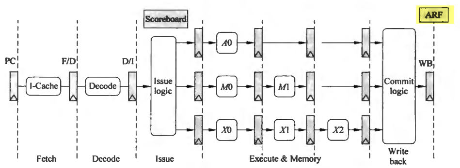
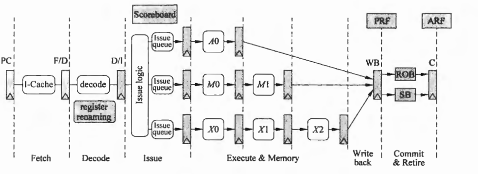
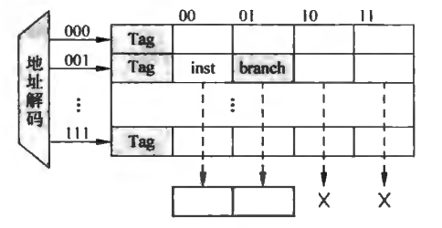
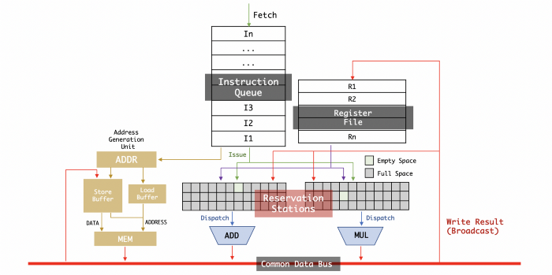

# 超标量流水线


```{note}
挖掘指令间潜在的并行性(ILP)主要有两种方法，一种是增加流水线的级数，一种是增加流水线内部的功能部件数量，这样可以每周期发出多条指令。
```

实现多发射处理器主要有两种方法，区别在于编译器和硬件的不同分工。如果指令发射与否的判断是在编译时完成的，成为静态多发射(static multiple issue)。如果指令的发射与否的判断是在动态执行过程中由硬件完成的，成为动态多发射(dynamic multiple issue)。

```{note}
动态多发射处理器也称为超标量处理器或朴素的超标量处理器。
```

许多超标量处理器扩展了动态发射逻辑的基础框架，形成了动态流水线调度技术。动态流水线调度技术由硬件逻辑选择当前周期内执行的指令，并尽量避免流水线的冒险和停顿。(即乱序)

为使得程序行为与简单的按序单发射流水线一致，乱序执行流水线的取指和译码都需要按序执行，以便正确处理指令间的相关。同样，提交阶段也需要按照取指的顺序依次将指令执行结果写入到寄存器和存储中。这种保守的处理方法称为**按序提交**。如果发生例外，处理器很容易能找到例外前的最后一条指令，也会保证只更新在此之前的指令需要改写的寄存器。虽然流水线的前端(取指和译码)和后端(提交阶段)都是按序执行，但是功能部件是允许乱序执行的。任何时候只要所需数据准备好，指令就可以被发射到功能部件开始执行。目前，所有动态调度的流水线都是按序提交的。


## 基础知识

本章节主要参考《计算机体系结构（第二版）》第6章“动态流水线”和第7章“多发射数据通路”

### 超标量处理器概览

在计算机领域有这样一个经典的公式来计算一个程序的执行时间
```
time = total instructions * CPI * cycle time
```

通过这三个因素可以看出，要加快处理器执行程序的速度，可以采取以下几种策略
1. 减少程序中指令的数量。这个取决于程序本身要完成的工作量、实现某个功能选择的算法、编译器的强大与否，甚至是指令集是否会对某些特殊的功能有扩展，例如x86指令集中的多媒体指令等。但是对于那些已经编写好的沟定程序，这个变量就变成定值了。
2. 减少每条指令在处理器执行所需要的周期数。也就是减少CPI，这也意味着增加IPC。对于普通的流水线处理器，每周期最多执行一条指令，因此IPC最大也就是1了，要向每周期执行多于一条的指令，就需要使用超标量(Superscalar)处理器。
3. 减少处理器的周期时间(cycle time)。在进行处理器的微架构设计时，可以通过精巧的电路设计、更深的流水线来减少处理器的周期时间；在现代处理器的设计中，优秀的EDA工具也可以帮助减少处理器的周期时间；除此之外，还有一个更关键的应吸纳更因素，那就是**硅工艺**，一个在90nm的硅工艺下很难达到1GHz频率的处理器，到了45nm的硅工艺时，就可以很容易达到那个速度了。

从上面给出的影响程序执行时间的三个要素可以看出，在程序一定的情况下，要想更快地执行它，需要处理器有比较大的IPC，以及更快的运行频率。

但是在实际当中，这两个因素是**互相制约、此消彼长**的关系，更大的IPC要求每周期执行更多条指令，这样设计复杂度就会急剧上升，导致处理器的周期时间很难降低下来；相反，很小的周期时间很难荣下复杂的逻辑设计，虽然可以通过更深的流水线来获得小的周期时间，但是却导致处理器在各种预测失败时，例如分支预测失败(mis-prediction)，有更大的惩罚(penalty)，严重降低了处理器的IPC，并增大了功耗，造成“高频低能”的后果。

```{caution}
深流水线中随着芯片面积的增大和主频的提高，处理器的功耗也会随之增大，制约了这种方法的使用，且分支预测时的惩罚也会增大，从而影响处理器的执行效率。
```

在处理器的发展史中，每周期可以执行多于一条指令的处理器并非超标量处理器一种，超长指令字(Very Long Instruction Word, VLIW)也是一种每周期都可以执行多条指令的处理器架构，但是这两种架构有着本质区别，超标量处理器是靠硬件自身来决定哪些指令可以并行地执行，而VLIW处理器则是依靠编译器和程序员自身来决定哪些指令可以并行执行，这种处理器在硬件实现上是很简单的，在功能比较专一的专用处理器领域可以大有一番作为。

正是由于超标量处理器可以获得比较高的IPC，因此面向通用领域的高性能处理器都采用了这种结构，但是由于超标量处理器天生的复杂性，**并没有一套放之四海皆准的设计准则，很多时候需要处理器设计师根据实际的需求作出各种的折中(trade off)**。

#### 超标量处理器的流水线

简单来说，如果一个处理器每周期可以取出多与一条的指令送到流水线中执行，并且使用硬件来对指令进行调度，那么这个处理器就可以成为超标量处理器了。从本质上讲，超标量处理器可以有两种方式来执行指令，顺序执行和乱序执行。

|     | Frontend  |  Issue  |  Write Back |  Commit  |
|  ----  | ----  | ----  | ----  | ---- |
|In-Order Superscalar		 |in-order		|in-order		|in-order		|in-order		|
|Out-of-Order Superscalar		 |in-order		|out-of-order		|out-of-order		|in-order		|

在这个表格中，Frontend表示流水线中的取指令(Fetch)和解码(Decode)阶段，这两个阶段很难(事实上也没有意义)实现乱序执行。

##### 顺序执行

顺序执行的超标量处理器中，指令的执行必须遵循程序中指定的顺序。


在图中使用了一个缓存，称为Store Buffer(SB)，来存储store指令没有退休之前的结果，store指令在流水线的写回阶段，会将它的值从Store Buffer写到Store Buffer中，只有一条store指令真的从流水线中退休时，才可以将它的写道存储器中。使用了这个部件后，**Load指令此时除了从D-Caceh中寻找数据，还需要从Store Buffer中进行查找，这样在一定程度上增加了设计的复杂度**。

本节给出的流水线会在后面逐一详细介绍，下面对这个流水线中各个阶段做一个粗略的介绍。
1. Fetch(取指令):这部分负责从I-Cache中取指令，主要由两大部件构成，I-Cache负责存储最近常用的指令；分支预测器用来决定下一条指令的PC值。不同于普通的处理器，这两大部件在超标量处理器中会遇到新的问题，都需要新的处理。
2. Decode(解码):这部分用来识别出指令的类型、指令需要的操作数以及指令的一些控制信号，这部分设计和指令集是息息相关的。在超标量处理器中，即使对于RISC指令集，仍旧需要对一些特殊的指令进行处理，这些内容增加了解码部分的设计复杂度。
3. Register Renaming(寄存器重命名):在流水线的解码阶段，可以得到指令的源寄存器和目的寄存器，这些寄存器是逻辑寄存器，在指令集中定义好的，为了解决WAW和WAR这两种“伪相关性”，需要使用寄存器重命名的方法，将指令集中定义好的逻辑寄存器重命名为处理器内部使用的物理寄存器，物理寄存器的个数要多于逻辑寄存器，通过寄存器重命名，处理器可以调度更多可以并行执行的指令。由于寄存器重命名阶段需要的时间比较长，现实当中的处理器都会将其单独使用一级流水线，而不是和解码阶段放在一起。
4. Dispatch(分发):在这个阶段，被重命名之后的指令会按照程序中规定的顺序，写到发射队列(Issue Queue)、冲排序缓存(ROB)和Store Buffer等部件中，**如果在这些部件中没有空闲的空间可以容纳当前的指令，那么这些指令就需要在流水线的重命名阶段进行的等待，这就相当于暂停了寄存器重命名以及之前的所有流水线**。
5. Issue(发射): 经过流水线的分发(Dispatch)阶段之后，指令就写到了发射队列(Issue Queue)中，仲裁(select)电路会从这个部件中挑选合适的指令送到FU中执行，这个仲裁电路可繁可简，对于顺序进行发射(in-order issue)的情况，只需要判断发射队列中最旧的那条指令是否准备好就可以了，而对于乱序进行发射(out-of-order issue)的情况，则仲裁电路会变得非常复杂，他需要对发射队列中所有的指令进行判断，并从所有准备好的指令中选出最合适的那条指令，送到FU中执行，对于乱序执行的处理器，**这个阶段是顺序执行到乱序执行的分界点。**
6. Register File Read(读取寄存器): 被仲裁电路选中的指令需要从物理寄存器堆中读取操作数。事实上很大一部分指令都是通过旁路网络获得操作数的，这也为减少PRF的读端口提供了可能，由于超标量处理器每周期需要执行好几条指令，PRF所需要的端口个数也是比较多，**多端口寄存器堆的访问速度一般都不会很快**，因此在现实世界的处理器中，这个阶段都会单独使用一个流水段。
7. Execute(执行): 超标量处理器中这个阶段通常有很多不同类型的FU。
8. Write Back(写回): 这个阶段会将FU计算的结果写到物理寄存器堆(PRF)中，同时这个阶段还有一个重要功能，**就是通过旁路网路(bypassing network)将这个计算结果送到需要的地方，一般都是送到所有FU的输入端，由FU输入端的控制电路来决定最终需要的数据。**
9. Commit(提交): 这个阶段起主要作用的部件是ROB，他会将乱序执行的指令拉回到程序中规定的顺序。之所以能够完成这样的人物，是因为指令在流水线的分发(Dispatch)阶段，按照程序中规定的顺序(in-order)写到了重拍虚幻村中；


##### 乱序执行

在乱序执行的超标量处理其中，指令在流水线中不再遵循程序指定的顺序来执行，一旦某条指令的操作数准备好了，就可以将其送到FU中执行。


#### 超标量处理器中的Cache

在超标量处理器中，对Cache有着更特殊的需求，对于I-Cache来说，需要能够每周期读取多条指令，不过，它的延迟时间即使很大，例如有好几个周期，在一般的情况下也不会造成处理器性能的下降，仍旧可以实现每周期都可以读取指令的效果，除非遇到跳转的分支指令，这些延迟在会对性能造成影响。但对于D-Cache来说，他需要支持在每周期内有多条load/store指令的访问，也就是需要多端口的设计，但其容量本身就很大，如果采用多端口设计，则占用的面积和延迟就会很大，对处理器的性能造成负面的影响。因此对于I-Cache和D-Cache需要采用的设计思路是不一样的。

对于Cache来说，不管是并行访问还是串行访问，这两种射击方式都很难说谁优谁劣，并行访问的方式会有较低的时钟频率和较大的功耗，但是访问Cache的时间缩短了一个周期。但是考虑到在乱序执行的超标量处理器中，可以将访问Cache的这段时间通过填充其他的指令掩盖起来，所以对超标量处理器来说，当Cache的访问处于处理器的关键路径上时，可以使用串行访问的方式来提高时钟频率，同时并不会由于访问Cache的时间增加了一个周期而引起性能的明显降低。

很多处理器使处理器每周期取出的指令个数多于他能够解码的指令个数，通过一个缓存来将多余的指令缓存起来，这样就可以使后续的流水线得到充足的指令，避免了硬件资源的浪费。

例如MIPS 74Kf处理器就采用了这种做法，他是一个2-way的超标量处理器，当取指令的地址是四字对齐时，每周期可以从I-Cache中取出四条指令，这些指令会存储到一个称为指令缓存(Instruction Buffer,IB)的地方，后续的指令解码器从指令缓存中取指令，这样即使有些时候不能够从I-Cache中取出两条指令，仍能够保证后续的流水线从指令缓存中可以取到充足的指令。

```{admonition} 如果处理器实现了分支预测，那么对于取指令阶段有什么影响呢？
实现分支预测之后，从I-Cache中取指令的同时，就可以知道当前指令组(fetch group)中哪条指令是分支指令，如果他被预测执行，那么指令组中位于他之后的指令就不该进入到后续的流水线
```



### 动态流水线

所谓静态，指的是不允许指令的乱序执行。动态流水线的核心思想就是允许超车，指令准备好了就执行，不用等侯前面不相关的指令

#### 影响流水线效率的因素

程序的执行时间等于程序中的指令数乘以CPI再乘以时钟周期。由于指令相关容易引起流水线的阻塞，因此CPI等于一条指令的理想周期数加上指令相关引起的阻塞周期数。

指令的相关性主要包括数据相关、控制相关和结构相关。其中数据相关又可以分成
* RAW(Read After Write)
* WAW(Write After Write)
	在这种相关中，前一条指令读取寄存器时，后一条指令不能将结果写到寄存器中，这种类型的相关性是可以避免的，只要将后续指令的结果写到其他寄存器就可以了。
* WAR(Write After Read)
	在这种相关中，后面的指令必须等到前面的指令写完之后，自己才能执行写操作，这种类型的相关性也是可以避免的，只要后续的指令将结果写道其他寄存器就可以了。

RAW是真正的数据相关，因为指令之间存在着数据传递关系；WAW和WAR又称为假相关或名字相关，指令之间实际上不存在数据传递，因为名字相关并没有真正的数据交换，所以可以通过寄存器重命名来解决。

```{admonition} 寄存器重命名的设计思想
指令产生结果后不立即修改寄存器，而是先存起来等前面的指令都执行结束，保证不会发生例外或者转移取消时，才能修改寄存器
```

数据相关有时候特指RAW相关，RISC的兴起在很大程度上是因为在RISC结构中容易高效地判断指令间的数据相关，因为RISC是寄存器——寄存器型的，寄存器的数据相关比较容易判断，只要判断清楚了，就可以通过乱序执行来避免数据相关引起流水线阻塞。

存储器的相关不好判断，例如(R4) + 100指向的单元和(R6) + 20指向的单元在译码阶段不能判断其相关性，即使R4和R6的值已经读出来了，(R4) + 100和(R6) + 20不相等，也不能保证他们不相关，因为**他们表示的虚地址可能被映射到同一个物理地址**。

#### 指令调度技术

指令调度指的是不影响程序正确性的前提下，通过改变指令的执行次序来避免由于指令相关引起流水线阻塞。指令调度可以分为静态调度和动态调度。静态调度是由程序员和编译器在程序执行之前进行的指令调度；而动态调度是在程序执行过程中由硬件自动进行的指令调度。

```{admonition} 指令调度的基本思想
为了提高指令级并行的效率，通过寄存器重命名和指令重排来避免由于指令之间的数据相关和名字相关而引起的冲突
```

静态调度通过程序员或者编译器对指令进行精心埃列，把相关指令隔开，但其有以下几个问题
1. 编译器不是万能的，有些相关信息在编译时难以确定，比如访存操作之间是否存在相关或访存操作是否命中cache等。
2. 静态调度需要针对具体的流水线结构，针对某个流水线结构优化的代码在另一个流水线结构中不见得适用。

指令动态调度基本原理是：前面的指令由于相关而阻塞时，不阻塞后面不相关的指令。其具体做法是将译码分为两个流水级：译码和读操作数。在译码阶段，对指令进行译码并检查结构相关。在读操作数阶段，检查指令的操作数是否准备好，准备好就读操作数并送去执行，否则在一个称为ie保留站或发射队列的地方等待。

#### Tomasulo算法



在Tomasulo算法中，保留站还起到重命名寄存器的作用，通过寄存器重命名，指令和指令之间的寄存器相关变成了保留站之间的相关。

#### 例外和动态流水线

Tomasulo算法实现的非精确的例外。例外一旦出现，硬件就不好处理，尤其是一些多功能部件及多拍操作的例外处理比较困难。操作系统非常期望采用动态流水线的处理器能够提供精确例外。

所谓精确例外，就是在处理例外的时候，发生例外之前的所有指令都已经执行万了，例外指令后面的所有指令都还没有执行。

实现精确例外处理的方法就是把后面指令对机器状态的修改延迟到前面指令都已经执行完。具体来讲，在流水线中增加一个叫提交(Commit)的阶段，在这个阶段才真正的修改计算机的状态。在执行或者写回阶段，把指令的结果先写到被称为重排序(ReOrder Buffer,ROB)的临时缓冲区中，提交的时候，再把ROB的内容协会到寄存器或存储器。**ROB是微体系结构的概念，程序员时看不到的，程序员看得到的是计算机状态包括寄存器和存储器**

保留站和ROB是现在通用处理器的两个核心部件，他们两个的作用恰好相反：**保留站把有序变成乱序，ROB把乱序重新排回有序。**


```{note}
流水线的发展过程很有趣，一开始都是顺序执行；顺序效率不好，就发展到乱序执行；乱序在转移、例外时难以处理，又弄出ROB把顺序给找回来。这是一个顺序到乱序再到顺序的螺旋上升过程，通过这个过程，流水线的效率得到了极大的提升。现代处理器中的指令都是顺序进入、乱序执行、有序结束。保留站把顺序变成乱序，而ROB又把指令从乱序变为顺序。
```

### 多发射数据通路

#### 指令级并行技术

并行主要有三类技术：
1. 数据级并行(Data Level Parallelism, DLP)

	一条指令可以处理多个数据，最典型的就是向量指令。
2. 指令级并行(Instruction Level Parallelism, ILP)

	这种并行不需要修改程序(数据级并行就算需要重写程序)，而只需要修改硬件结构就可以提高性能。
	* 指令流水线通过时间重叠实现指令级并行，实际上是提高了频率
	* 多发射通过空间重复实现指令级并行
	* 乱序执行提高流水线的效率，挖掘指令间潜在的可重叠性或不相关性。
3. 线程级并行(Thread Level Parallelism, TLP)

	或者称为进程级并行，这是比较宏观的并行，现在多核技术都是这种并行。

#### 乱序执行的流水线通路

保留站可以采用独立、分组和全局3种结构，保留站和寄存器的关系有在保留站前读寄存器和在保留站后读寄存器两种情况，重命名寄存器可以独立于结构寄存器，也可以和结构寄存器一起合并成物理寄存器堆。

无论结构怎么设计，目标都是正确且高效地执行程序。只要搞清楚保留站的作用是能够乱序执行指令；ROB的作用是能够有序结束指令；重命名寄存器可以与ROB或者保留站结合，也可以与结构寄存器结合形成物理寄存器堆等，但是流水线结构的基本原理是不变的。

#### 多发射结构

多发射结构和单发射结构的区别首先在与他的指令和数据通路变宽了。

## 动手实践
