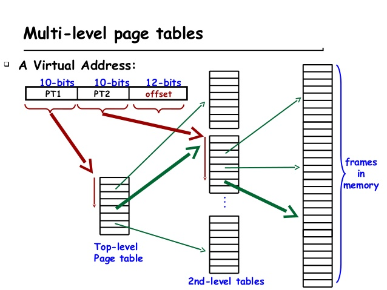

# 虚拟存储器

基本思想是对于一个程序来说，他的程序、数据和堆栈的总大小可以超过实际的物理内存。主存可以为通常由磁盘实现的辅助存储充当“cache”，这种技术被称为虚拟存储。

从历史上看，提出虚拟存储的主要动机有两个：
1. 允许在多个程序之间高效安全地共享内存，例如云计算的多个虚拟机所需的内存
2. 消除小而受限的主存容量对程序设计造成的影响。

50年后，第一条变成了主要设计动机。

## 基础知识

如果使用了虚拟地址，则处理器输出的地址就是虚拟地址了，这个地址不会被直接送到物理存储器中，而是需要先进行地址转换，因为虚拟地址是没有办法直接寻址物理存储器的。负责地址转换的部件一般称为内存管理单元(Memory control unit,MMU)

### 地址转换

虚拟存储器从最开始出现一直到现在，有很多种实现的方式，本节只讲述目前最通用的方式——基于分页(page)的虚拟存储器。

虚拟地址空间的划分以页(page)为单位，典型的页大小为4KB，相应的物理地址空间也进行同样大小的划分，由于历史的原因，在物理地址空间中不叫做页，而称为frame，它和页的大小必须相等。

#### 单级页表

在虚拟存储器的系统中，都是使用一张表格来存储从虚拟地址到物理地址的对应关系，这个表格称为页表(page table,PT)，这个表格放在什么地方呢？当然可以在处理器中使用寄存器来存储它，但是考虑到他会占用不菲的硬件资源，很少会有人这样做。一般都是将这个表格放在物理内存中，使用虚拟地址来寻址。每个程序都有自己的也表，用来将这个程序中的虚拟地址映射到物理内存的某个地址，为了指示一个程序的页表在物理内存中的起始地址，在处理器中一般会包括一个寄存器，用来存放当前运行程序的页表在物理内存中的起始地址，这个寄存器称为页表寄存器(Page Table Register, PTR)

真正寻址页表的其实不是虚拟地址的所有位数，而只是VPN就可以了，从页表中找到的内容也不是整个物理地址，而只是PFN。


#### 多级页表

将页表划分为若干个更小的页表，称他们为子页表，处理器在执行进程的时候，不需要一下子把整个线性页表都放入物理内存中，而是根据需求逐步地放入这些子页表。而且这些子页表不再需要占用连续的物理内存空间了，也就是说，两个相邻的子页表可以放在物理内存中不连续的位置，这样也提高了物理内存的利用效率，但是，由于所有的子夜表是不连续地放在物理内存中，所以仍旧需要一个表格，来记录每个子页表在物理内存中存储的位置，称这个表格为第一级页表，而那些子页表为第二级页表。

```{note}
上面这段话隐藏的意思是，如果划分为子页表，按需放入，同样可以减少内存空间，如果放在连续的物理内存空间中时，可以使用VPN直接寻址，但是由于为了物理内存的分配灵活，允许他们放在不连续的物理内存，因此就需要额外的表格来寻址这些子页表。
```



当操作系统创建一个进程时，就在物理内存为这个进程找到一块连续的4KB空间，存放这个进程的第一级页表，并且将第一级也标在物理内存中的起始地址放到PTR寄存器中。通常这个寄存器都是处理器中的一个特殊寄存器，如ARM中的TTB寄存器，x86中的CR3寄存器等。随着这个进程的执行，操作系统会逐步在物理内存中创建第二级页表，每次创建一个第二级页表，操作系统都要将他的起始地址放到第一级页表对应的表项中。

当虚拟地址的p1部分发生变化，操作系统就需要在物理内存中创建一个新的第二级页表，并将这个页表的起始地址写到第一级页表对应的PTE中，当虚拟地址p1部分不发生变化，只是p2部分发生变化时，此时不需要创建新的第二级页表，表示需要使用一个新的页，操作系统将这个新的页从下级存储器中取出来并放到物理内存中。然后将这个页的在物理内存中的起始地址填充到第二级页表对应的PTE。

这种多级页表的结构比较简单，容易用硬件实现页表的查找，因此在很多硬件实现Page Table Walk的处理器都是采用了这种结构，如ARM、x86和PowerPC等。所谓的Page Table Walk是指当发生TLB缺失时，需要从页表中找到对应的映射关系并将其写回到TLB的过程。这种多级页表还有一个优点，那就是他容易扩展，例如当处理器的位数增加时，可以通过**增加级数的方式**来减少页表对于物理内存的占用。

为进程分配的只是虚拟存储器的页，这些也有可能存在物理内存中，也可能临时存在于更下一级的硬盘中，在硬盘中这部分空间称为swap空间。当物理内存不够用时，将物理内存中的一些不常用的页保存到硬盘上的swap空间，当需要用到这些页时，在将其从硬盘的swap空间加载到物理内存，因此处理器中等效可以使用的物理内存总量是**物理内存的大小+硬盘中swap空间的大小**。


#### Page Fault

在现代处理器中，都是使用软件来处理Page Fault。原因为Page Fault花费时间长，软件处理时间相比起来微乎其微，同时可以根据实际情况实现灵活的替换算法。

需要注意的是，直接使用虚拟地址并不能知道一个页位于硬盘的哪个位置，也需要一种机制来记录一个进程的每个页位于硬盘中的位置。通常操作系统会在硬盘中为**一个进程的所有页开辟一块空间**，这就是之前说过的swap空间，在这个空间中存储一个进程所有的页，操作系统在开辟swap空间的同时，还有用一个表格来记录每个页在硬盘中存储的位置，这个表格的结构其实和页表一样，他可以单独存在，从理论上来讲当然也可以和页表合并在一起。但实际当中他们是分开放置的，因为不管一个页是不是在物理内存中，操作系统都必须记录一个进程的所有页在硬盘中的位置，因此需要单独地使用一个表格来记录他。

虚拟存储的写入采用写回法，因为和磁盘交换数据花费时间太长，因此需要在页表的PTE中增加dirty位。

为了帮助操作系统实现近似LRU替换算法，需要处理器在硬件层面上提供支持，这可以在页表的每个PTE中增加一位，用来记录每个页最近是否被访问过，这一位称为“使用位(use)”，当一个页被访问时，“使用位”被置为1，操作系统周期性的将这一位清零，然后过一段时间再去查看它，这样就能够知道每个页在这段时间是否被访问过。

总结来说，为了处理Page Fault，处理器在硬件上需要提供的支持有如下几种：
1. 在发现Page Fault时，要能够产生对应类型的异常，并且能够跳转到他的异常处理程序的入口地址。
2. 当要写物理内存时，例如执行了store指令，需要硬件将页表中对应的PTE的脏状态位置为1
3. 当访问了物理内存时，例如执行了load/store指令，需要硬件将页表中对应PTE的“使用位”置为1，表示这个页最近被访问过。

```{caution}
需要注意的是，在写回类型的Cache中，load/store指令在执行的时候，只会对D-Cache起作用，对物理内存中页表的更新可能会有延迟，当操作系统需要查询页表中的这些状态位时，首先需要将D-Cache中的内容更新到物理内存中，这样才能够使用到页表中正确的状态位。
```

小结
P76(总结的很好，回头更新)//TODO

### 程序保护

需要满足程序保护的需求，则需要操作系统和用户程序对于不同的页有不同的访问权限，这一点应该在硬件上就加以控制，通常这种控制是通过页表来实现的。


```{caution}
需要注意的是，操作系统本身也需要指令和数据，但是考虑到他需要能够访问物理内存中所有的空间，**所以操作系统一般不会使用页表**，而是直接可以访问物理内存，在物理内存中有一部分地址范围专门供操作系统使用，不允许别的进程随便地访问它，例如在32位MIPS处理器中，将整个4GB虚拟存储空间分为了kseg0、kseg1、kseg2和kuseg共四个区域，其中kseg0区域的属性是unmapped，也就是说，这部分地址是不需要经过页表进行转换的，操作系统内核的指令和数据就是位于kseg0区域。

除了MIPS，现实中其他处理器也有自己的权限管理方法，如ARM处理器采用了两级页表的方法，第二级页表的每个PTE中都有一个AP部分，AP部分直接决定了每个页的访问权限。
```

如果出现非法的访问，会产生一个异常通知处理器，使处理器跳转到异常处理程序中，这个处理程序一般是操作系统的一部分。

事实上第一级页表中也可以进行权限控制，而且可以控制更大的地址范围。通过这种粗粒度（第一级页表的权限控制）和细粒度（第二级页表的权限控制）的组合，可以在一定程度上提高处理器的执行效率。

在处理器的存储器映射(memory map)中，总会有一块区域时不可缓存的，用于访问外设等。例如MIPS处理器的kseg1区域就不允许被缓存，他的属性是uncached，这个属性**也应该在页表中加以标记**。在访问页表从而得到物理地址时，会对这个地址对应的页是否允许缓存进行检查，如果发现这个页的属性时不允许缓存的，那么就需要直接使用刚刚得到的物理地址来访问外设或者物理内存；如果这个页的属性时允许被缓存，那么就可以直接使用物理地址对D-Cache进行寻址。

到目前为止，总结起来，在页表中的每个PTE都包括如下的内容：
1. PFN
2. Valid
3. Dirty
4. Use
5. AP
6. Cacheable

### 加入TLB和Cache

TLB存储了页表中最近被使用过的PTE，从本质上来讲，TLB就是页表的Cache，但是TLB不同于一般的Cache，他只有时间相关性。正因如此Cache设计中很多优化方法，例如预取，是没有办法应用于TLB中的。

在现代处理器中，很多都采用两级TLB，第一级TLB采用哈佛结构，分为指令TLB(I-TLB)和数据TLB(D-TLB)，一般采用全相连的方式；第二级TLB是指令和数据共用，一般采用组相连的方式。

因为TLB采用了全相连的方式，所以相比页表，多了一个Tag的项，他保存了虚拟地址的VPN，用来对TLB进行匹配查找，TLB中其他的项完全来自于页表，每当发生TLB缺失时，将PTE从页表中搬移到TLB内。

在TLB以上的所有项中，除了use和drity位，其他的项在TLB中是不会改变的。

解决TLB缺失的本质就是从页表中找到对应的映射关系，并将其写回到TLB内，这个过程称为Page Table Walk，可以用硬件的状态机来完成这个事情，也可以使用软件来做这个事情。
1. 软件实现Page Table Walk
	很显然，**处理器需要支持直接操作TLB的指令**，如写TLB、读TLB。MIPS和Alpha处理器一般采用这种方法。**但是为了防止在执行TLB缺失的异常处理程序时再次发生TLB缺失，一般都将这段程序放到一个不需要进行地址转换的区域**，这样处理器在执行这段异常处理程序时，相当于直接使用物理地址来取指令和数据，避免了再次发生TLB缺失的情况。
2. 硬件实现Page Table Walk
	前面说过多级页表的最大优点就是容易使用硬件进行查找，只需要使用一个状态机，逐级进行查找就可以了，如果从页表中找到的PTE时有效的，那么就将他写回到TLB中，这个过程完全由硬件完成，对软件透明。但如果PTE无效，那么硬件就无能为力了，此时MMU会产生Page Fault类型的异常，由操作系统来处理这个情况。使用硬件处理TLB缺失的这种方法更适合超标量处理器，它不需要打断流水线，因此从理论上来说，性能也会更好一些。但这需要操作系统保证页表已经在物理内存中建立好了，并且将页表基地之预先写到处理器内部寄存器中。ARM、PowerPC和x86都采用了这种方法。

#### TLB的设计

##### TLB的替换

对于组相连或全相连结构的TLB，当一个新的PTE被写到TLB中，如果当前TLB没有空闲位置了，那么就要考虑将其中一个表项进行替换，理论上说，Cache中使用的替换方法在TLB这里都可以使用，例如最近最少使用算法，但是实际上对于TLB来说，**随机替换算法是一种比较合适的方法。**

##### TLB的写入

如果TLB采用写回(Write Back)方式的实现策略，那么使用位(use)和脏状态位(dirty)改变的信息并不会马上从TLB中写回到页表，只有等到TLB中的一个表项要被替换的时候才会将它对应的信息写到页表中。这种工作方式给操作系统进行页替换带来了新的问题，因为此时在页表中记录的状态位有可能是过时的。

一种比较容易想到的解决方法就是当操作系统在Page Fault发生时，首先将TLB中的内容写回到页表，然后就可以根据页表中的信息进行后续的处理了。

实际上这个过程时可以省略的，操作系统完全可以认为被TLB记录的所有页都是需要使用的，这些页在物理内存中不能够被替换，操作系统可以采用一些办法来记录页表中哪些PTE被放到了TLB中，而且这样做还有一个好处，他避免了物理内存中一个页被踢出之后，还需要查找他在TLB中是否被记录了，如果是，**需要在TLB中将其置为无效，因为在页表中已经没有这个映射关系了，因此TLB中也不应该有。**总结起来就是TLB中记录的所有页都不允许从物理内存中被替换。

操作系统在Page Fault时，如果从物理内存中选出的要被替换的页是脏状态，那么首先需要将这个页写回到硬盘中，然后才能将其覆盖。但是如果在系统中使用了D-Cache，那么物理内存中的每个页的最新内容都可能存在于D-Cache中，要将一个页的内容写回到硬盘，首先需要确认D-Cache中是否保留着这个页中的数据。此时操作系统就必须能从D-Cache中找到这个页的内容，并将其写回到物理内存中，**这要求操作系统有控制D-Cache的能力。**(见Cache的设计)

##### 对TLB进行控制

由于TLB是页表的缓存，所以TLB中的内容必然是页表的子集，也就是说，如果由于某些原因**导致一个页的映射关系在页表中不存在了，那么它在TLB中也不应该存在**。而操作系统会在一些情况下，把某些页的映射关系从页表中抹掉。
1. 一个进程结束时
	如果没有ASID，需要将TLB的全部内容都置为无效，这样保证新的进程可以使用一个干净的TLB，如果实现了ASID，只要将这个进程对应的内容在TLB中置为无效就可以了。
2. 进程占用物理内存过大时
	一般操作系统会尽量避免将存在于TLB中的页置为无效，因为这些页在以后很可能会被继续使用。

因此抽象出来，对TLB的管理需要包括的内容有以下几点：
1. 能够将I-TLB和D-TLB的所有表项置为无效
2. 能够将I-TLB和D-TLB中某个ASID对应的所有表项置为无效
3. 能够将I-TLB和D-TLB中某个VPN对应的表项置为无效

ARM处理器中使用系统控制协处理器中的寄存器来对TLB进行控制，因此只需要使用访问写处理器的指令来向CP15中对应的寄存器写入相应的值，就可以对TLB进行操作；
(其实不仅是对于TLB，在ARM处理器中对于存储器的管理，例如Cache和BTB等部件，都是通过写处理器来实现的)
而MIPS中则直接提供了对TLB进行操作的指令，软件直接使用这些指令对TLB进行管理。

RISCV // TODO

#### Cache的设计

1. Virtual Cache
	
	使用物理地址寻址的Cache称为物理Cache，但现在需要先经过TLB才能在访问物理Cache，因此必然会增加流水线的延迟，如果还想获得和以前一样的运行频率，就需要将访问TLB的过程单独使用一级流水线，但是这样就增加了分支预测失败时的惩罚，也增加了load指令的延迟，不是一个好的做法。
	使用虚拟地址寻址的Cache称为虚拟Cache。当虚拟Cache发生缺失，仍需要TLB将对应的虚拟地址转换为物理地址，然后再去物理内存中获得对应的数据。

	但是直接使用虚拟Cache则会引入新的问题，主要可以概括为两方面
	* 同义问题(alias)，即多个名字对应相同的物理地址。并不是所有的虚拟Cache都会发生同义问题，这取决于页的大小和Cache的大小。如果大小为4KB的页，对于容量小于4KB的直接相连的Cache，没有同义问题。

		可时使用bank结构的Cache来解决该问题
	* 同名问题(homonyms)，即相同的名字对应不同的物理位置。不同进程之间存在很多相同的虚拟地址对应不同的物理地址。

		既然无法直接从虚拟地址中判断它属于哪个进程，那么就为每个进程赋一个编号，每个进程中产生的虚拟地址都附上这个编号，这个编号就相当于虚拟地址的一部分，即ASID(Address Space IDentifier)，使用ASID相当于扩展了虚拟存储器的空间，此时**仍然是每个进程都可以看到整个4GB的虚拟存储器空间，而且每个进程的4GB都互相不交叠**。

		但是使用ASID也引入一个新的问题，当多个进程想要共享同一页时，如何实现这个功能呢？这就需要在ASID之外再增加一个标志位，称为Global位。当一个页不只是属于某一个进程，而是被所有进程共享时，就可以将这个Global位置为1，这样在查找页表的时候，如果发现G位为1，那么就不需要再理会ASID的值。

		**支持ASID的处理器中会有一个进程来保存当前进程的ASID值，每次操作系统创建一个进程时，就会给当前的进程分配ASID值，并将其写到ASID寄存器中，这个进程中所有的虚拟地址都会在前面被附上这个ASID值，在TLB中，ASID和VPN一起组成了新的虚拟地址**

	

2. 对Cache进行控制

	由于要保持Cache是物理内存中的子集这一关系，需要对下列情况进行特殊处理。
	1. 当DMA需要将物理内存中的数据搬移到其他地方之前，此时物理内存中的最新数据还存在于D-Cache中，因此在进行DMA搬移至前，需要将D-Cache中的所有脏状态内容写回到物理内存中。
	2. 当DMA从外界搬移数据到物理内存的一个地址，而这个地址又在Cache中被缓存，此时需要将D-Cache中这个地址的内容置为无效。
	3. Page Fault如果被覆盖页为脏，并且这个页内的部分内容还存在于D-Cache，那么需要先将D-Cache内容写回到物理内存中，才能将这个页写回到磁盘。
	4. 自修改命令。需要将D-Cache写回到物理内存中，然后将I-Cache中所有内容都清空。

	对上面的所有操作进行抽象，得出需要对Cache进行的操作有如下几种。
	1. 将I-Cache内的所有Cache line都置为无效
	2. 将I-Cache内的某个Cache line都置为无效
	3. 将D-Cache内的所有Cache line都置为无效
	4. 将D-Cache内的某个Cache line都置为无效
	5. 将D-Cache内的所有Cache line都进行Clean，并置为无效
	6. 将D-Cache内的所有Cache line都进行Clean，并置为无效
	
	Cache的clean指将脏状态的Caclen line写回到物理内存的过程。

	
#### 将TLB和Cache放入流水线

1. PIPT

	由于寻址TLB的过程也需要消耗一定的时间，为了不至于对处理器的周期时间造成太大的负面影响，可能需要将访问TLB的过程单独作为一个流水段，这样相当于增大了流水线的级数，对于I-Cache来说，增加一级流水线会导致分支预测失败时有更大的惩罚，而对于D-Cache来说，增加一级流水线会造成load指令的延迟变大。

2. VIPT

	这种方式使用了虚拟Cache，根据Cache的大小，直接使用虚拟地址的一部分来寻址这个Cache。在不影响流水线深度的情况下，获得了很好的性能，但是对Cache的大小有了限制。

	

3. VIVT

	这种方式直接缓存了从虚拟地址到数据的过程，他会使用虚拟地址来寻址Cache，并使用虚拟地址作为Tag，因此这种Cache可以称得上是名副其实的Vritual Cache了。


在现代处理器中，L2及其更下层的Cache都是物理Cache


## 动手实践
